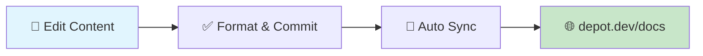

<div align="center">

# 🚀 Depot Documentation


### _Build faster. Waste less time._

[](https://depot.dev)
[](https://depot.dev/docs)
[](https://github.com/depot/depot-docs/actions)

</div>

---

<div align="center">
<table>
<tr>
<td align="center">⚡</td>
<td align="center">🌍</td>
<td align="center">📦</td>
<td align="center">🔗</td>
</tr>
<tr>
<td align="center"><strong>55x Faster</strong><br/>Lightning builds</td>
<td align="center"><strong>Multi-Arch</strong><br/>Intel & Arm support</td>
<td align="center"><strong>Smart Cache</strong><br/>Distributed caching</td>
<td align="center"><strong>CI Ready</strong><br/>Seamless integration</td>
</tr>
</table>
</div>

---

## 🎯 About This Repository

This repository contains the **documentation content** for [Depot](https://depot.dev) — the platform that supercharges your builds with up to **55x faster container builds at half the cost**.

> **📍 Important:** This is a content-only repository that syncs to the main Depot application. You cannot run a local documentation server from this repo.

<details>
<summary><strong>🏗️ How It Works</strong></summary>



1. **Content Creation**: Edit MDX files in this repository
2. **Auto-Sync**: Changes automatically sync to the main `depot/app` repository
3. **Live Updates**: Documentation appears on [depot.dev/docs](https://depot.dev/docs)

</details>

---

## 🚀 Quick Start

<table>
<tr>
<td width="50%">

### 📋 Prerequisites

- **Node.js** `18+` → [Download](https://nodejs.org/)
- **pnpm** → [Install Guide](https://pnpm.io/installation)

</td>
<td width="50%">

### ⚡ Setup Commands

```bash
# Clone repository
git clone <repo-url>
cd depot-docs

# Install dependencies
pnpm install
```

</td>
</tr>
</table>

---

## 🛠️ Development Workflow

<div align="center">

| Command              | Description         | Usage                                 |
| -------------------- | ------------------- | ------------------------------------- |
| `pnpm run fmt`       | 🎨 **Format Files** | Auto-format all content with Prettier |
| `pnpm run fmt:check` | ✅ **Check Format** | Verify formatting without changes     |

</div>

### 📝 Content Editing Process

1. **Edit** MDX files in the `content/` directory
2. **Format** your changes with `pnpm run fmt`
3. **Commit** and push to trigger auto-sync
4. **Preview** changes live at [depot.dev/docs](https://depot.dev/docs)

> **💡 Pro Tip:** Use the formatting commands before committing to ensure consistent style!

---

## 📁 Project Architecture

<div align="center">

```
depot-docs/
├── 📂 content/                    # 📚 Documentation Content
│   ├── 🗄️  cache/                # Caching documentation
│   ├── ⌨️  cli/                   # CLI reference docs
│   ├── 🐳 container-builds/       # Container build guides
│   ├── ⚙️  github-actions/        # GitHub Actions integration
│   ├── 🔌 integrations/           # Third-party integrations
│   ├── ☁️  managed/               # Managed infrastructure
│   ├── 📖 overview/               # Getting started guides
│   └── 📦 registry/               # Registry documentation
├── 📄 package.json               # Dependencies & scripts
└── 📋 README.md                  # This file
```

</div>

---

## 🎨 Content Format

Our documentation uses **MDX** (Markdown + React components):

<table>
<tr>
<td width="50%">

**Example MDX:**

```mdx
---
title: 'Getting Started'
description: 'Quick start guide'
---

import {CheckCircleIcon} from '~/components/icons'

# Getting Started

<CheckCircleIcon className="text-green-500" />
Build faster with Depot!
```

</td>
<td width="50%">

**Features:**

- ✅ Frontmatter metadata
- ✅ React component imports
- ✅ Interactive examples
- ✅ Syntax highlighting
- ✅ Custom styling

</td>
</tr>
</table>

---

## 🌟 Contributing

<div align="center">

We ❤️ contributions! Help us improve Depot's documentation.

[](https://github.com/depot/depot-docs/pulls)

</div>

### 📐 Style Guidelines

- Use **clear, concise** language
- Include **practical examples**
- Format with `pnpm run fmt`
- Follow existing **content structure**

---

<div align="center">

## 🔗 Useful Links

<table>
<tr>
<td align="center">
<a href="https://depot.dev/docs">

</a>
</td>
<td align="center">
<a href="https://depot.dev">

</a>
</td>
<td align="center">
<a href="https://depot.dev/signup">

</a>
</td>
</tr>
</table>

---

<h3>⚡ Ready to supercharge your builds?</h3>

**[Start building with Depot today →](https://depot.dev)**  
_Experience up to 55x faster container builds_

---

<sub>Made with ❤️ by the Depot team</sub>

</div>
